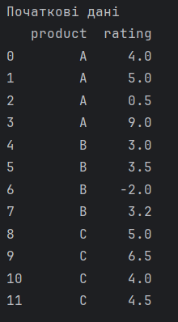
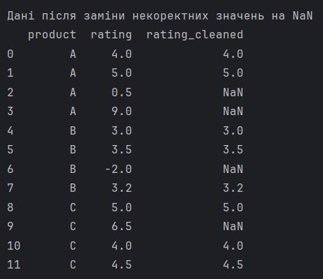
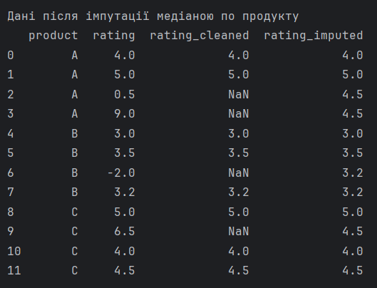
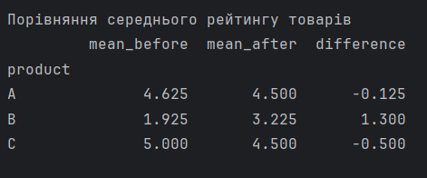

# ЗАВДАННЯ (7 ВАРІАНТ)

## Умова:

Виявити некоректні значення rating (менше 1 або більше 5), замінити їх на NaN, виконати імпутацію медіаною по product і порівняти середній рейтинг товарів до/після.

## [Код до завдання](task_files/main.py)

## Як працює програма:

Оскільки реальних даних не було надано, я створив `pandas.DataFrame`, який імітує відгуки користувачів на три продукти: A, B та C. Серед коректних оцінок (від 1 до 5) спеціально додані аномальні значення (наприклад, 0.5, 9.0, -2.0, 6.5).

За умовою, рейтинг має бути в межах від 1 до 5 включно. Всі інші значення вважаються помилковими. Для цього використовується метод `.where()` з бібліотеки Pandas:
```df['rating'].where((df['rating'] >= 1) & (df['rating'] <= 5), np.nan)```

Цей код залишає значення як є, якщо воно задовольняє умову `1 <= rating <= 5`. Якщо умова не виконується, значення замінюється на NaN (Not a Number).

Замість того, щоб просто видаляти рядки з пропусками або заповнювати їх середнім по всьому датасету, я використовую групову імпутацію. Програма обчислює медіану рейтингів для кожного окремого продукту і замінює пропуски саме цим значенням.

```df.groupby('product')['rating_cleaned'].transform(lambda x: x.fillna(x.median()))```

- `groupby('product')` розбиває дані на групи для кожного товару.
- `transform(...)` застосовує функцію до кожної групи і повертає результат такого ж розміру, як і початковий індекс.
- `lambda x: x.fillna(x.median())` для кожної групи знаходить NaN і заповнює їх медіаною цієї ж групи (яка розраховується лише по коректним значенням, оскільки аномалії вже перетворено на NaN).

Після цього обидві серії об'єднуються в одну таблицю за допомогою `pd.concat` і додається стовпець `difference`, щоб наочно побачити, наскільки змінився середній бал кожного товару після очищення. Товари з екстремально високими помилковими оцінками (як 9.0) впадуть у рейтингу до об'єктивного рівня, а товари з негативними помилками (як -2.0) — зростуть.

## Результат роботи:

### Початкові дані:



### Дані після заміни некоректних значень на NaN:



### Дані після імпутації медіаною по продукту:



### Порівняння середнього рейтингу товарів:


