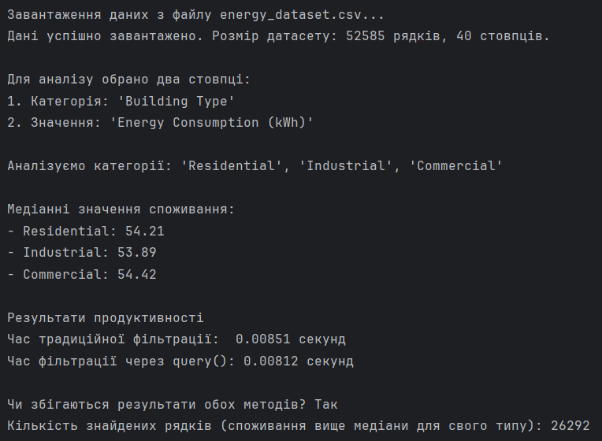

# ЗАВДАННЯ (7 ВАРІАНТ)

## Умова:

Використовуючи query(), знайдіть всі рядки в DataFrame, що містять значення енергоспоживання більше за медіану для кожного стовпця (наприклад, за різними типами споживачів). Оцініть продуктивність фільтрації за допомогою query() на великих наборах енергетичних даних.

## [Код до завдання](task_files/main.py)

## Як працює програма:

Я працюю з [датасетом](https://www.kaggle.com/datasets/datasetengineer/southern-california-energy-consumption) у довгому (long) форматі. З усього масиву даних важливі лише два стовпці:

1. Категорія (Building Type — Residential, Commercial, Industrial).
2. Значення (Energy Consumption (kWh) — кількість спожитої енергії).

### Традиційний підхід (Boolean Indexing)

Звичайна фільтрація у Pandas для такої умови виглядає досить громіздко. Потрібно комбінувати умови логічним «І» (&) для кожної категорії, а потім об'єднувати їх логічним «АБО» (|):

```
filtered = df[((df[col_type] == cat1) & (df[col_value] > med1)) | ((df[col_type] == cat2) & (df[col_value] > med2)) | ((df[col_type] == cat3) & (df[col_value] > med3)) ]
```

Такий код важко читати, особливо якщо категорій або умов стає більше. Крім того, він постійно повторює звернення до датафрейму `df[...]`.

### Рішення за допомогою .query()

Метод `.query()` дозволяє записати ту саму логіку у вигляді єдиного, зрозумілого текстового рядка:

```
query_string = (
    f"(`{col_type}` == @cat1 and `{col_value}` > @med1) or "
    f"(`{col_type}` == @cat2 and `{col_value}` > @med2) or "
    f"(`{col_type}` == @cat3 and `{col_value}` > @med3)"
)
df.query(query_string)
```

Ключові особливості синтаксису:
- Оскільки в реальних датасетах назви стовпців часто містять пробіли або дужки (наприклад, Energy Consumption (kWh)), їх необхідно брати у зворотні апострофи, щоб `query` зрозумів, що це єдина назва стовпця.
- Символ `@` вказує Pandas на те, що `cat1`, `med1` і т.д. — це змінні з коду, а не назви стовпців. Метод автоматично підставить їхні значення у рядок запиту.
- Я використовуємо звичні слова `and` та `or` замість побітових операторів `&` та `|`.

### Оцінка продуктивності

На великих датасетах (від сотень тисяч до мільйонів рядків) метод `.query()` часто показує кращу продуктивність і споживає менше пам'яті. Традиційний метод під час виконання `(df['Type'] == 'Residential') & (df['Value'] > 50)` створює в оперативній пам'яті кілька тимчасових масивів розміром з весь датасет, що містять лише значення `True` або `False`. Потім він попарно порівнює ці великі масиви. Метод `.query()`, використовуючи C-бібліотеку numexpr, компілює рядок у високоефективний код і дуже швидко обчислює вираз для кожного рядка, уникаючи створення важких проміжних масивів у пам'яті.

## Результат роботи:


