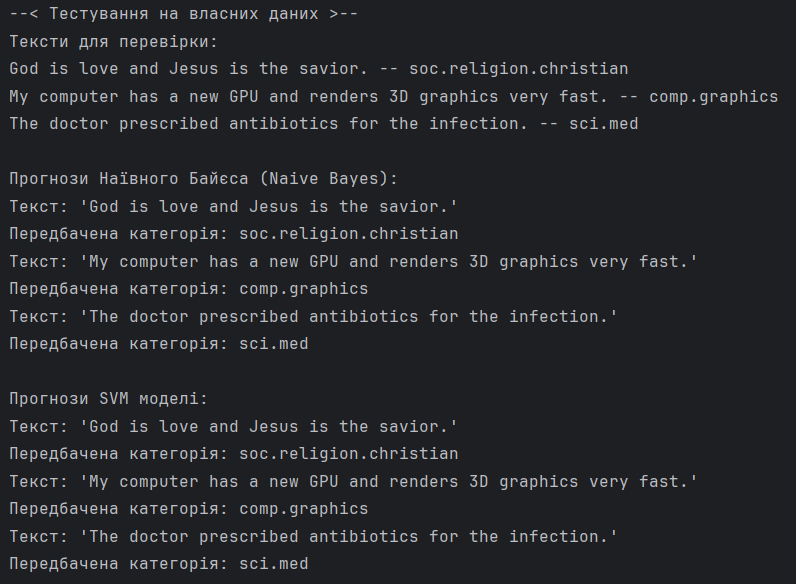

# ЗАВДАННЯ (7 ВАРІАНТ)

## Умова:

Класифікація текстів за допомогою машинного навчання: Реалізувати класифікацію текстових документів за допомогою Naive Bayes або Support Vector Machine (SVM).

**У цьому завданні реалізовано та порівняно роботу обох алгоритмів для наочності.*

## [Код до завдання](task_files/main.py)

## Як працює програма:

Програма використовує відомий набір текстових даних `20 Newsgroups` (новинні групи), вбудований у бібліотеку `scikit-learn`. Для оптимізації швидкості роботи та наочності результатів було обрано 4 тематичні категорії: `alt.atheism`, `soc.religion.christian`, `comp.graphics` та `sci.med`.
Перш ніж тексти потрапляють у моделі машинного навчання, вони проходять етап векторизації.

### 1. Векторизація тексту 

Алгоритми не розуміють слів, тому тексти перетворюються на числа за допомогою `TfidfVectorizer`. Цей метод (Term Frequency-Inverse Document Frequency) оцінює важливість кожного слова: чим частіше слово зустрічається в конкретному тексті, але чим рідше у всьому наборі даних, тим вища його вага. Це дозволяє відсіяти шум (прийменники, сполучники і тд) і виділити ключові терміни.
Після векторизації дані передаються у два різні класифікатори за допомогою `Pipeline`.

### 2. Наївний Байєс

Простий ймовірнісний класифікатор, заснований на теоремі Байєса. Він називається наївним, оскільки припускає, що всі слова в тексті з'являються незалежно одне від одного (що в реальних мовах не так).
Його плюсом є те, що він дуже швидкий у навчанні й прогнозуванні та добре працює як базовий метод. Але мінусом такого підходу є те, що він може плутати схожі за семантикою категорії через спрощене розуміння контексту (що і сталося в даній програмі та відображено в звіті по моделі Баєса).

### 3. Метод опорних векторів (SVM)

Алгоритм, який намагається знайти в багатовимірному просторі ознак (слів) таку гіперплощину (лінію розмежування), яка найкраще розділяє класи текстів, залишаючи максимальний зазор між ними. Оскільки текстові дані мають велику кількість вимірів (тисячі різних слів) - це один з найпотужніших алгоритмів для роботи з ними, але він потребує більше часу на навчання порівняно з Наївним Баєсом.

### Оцінка продуктивності

За результатами роботи метод SVM показав високу стабільність для всіх 4-х категорій, його F1-score (баланс між точністю і повнотою) становить близько 0.89–0.93. Він однаково добре розпізнає і медицину, і графіку, і релігію. В свою чергу метод Наївного Баєса зіткнувся з проблемами при розрізненні релігійних текстів. Для категорії `soc.religion.christian` він показав надзвичайно високу повноту (Recall = 0.99), але низьку точність виявлення (Precision = 0.65). Це означає, що Байєс знайшов майже всі християнські тексти, але ціною того, що помилково відніс туди багато текстів з інших категорій (наприклад, з атеїзму).
За такими результатами, можна сказати, що для задачі класифікації складних тематичних текстів метод опорних векторів виявився значно ефективнішим та надійнішим за Байєса.

## Результат роботи:

### Завантаження даних та результати моделі Наївного Баєса

### Результати моделі SVM

### Тестування моделей на власних даних

