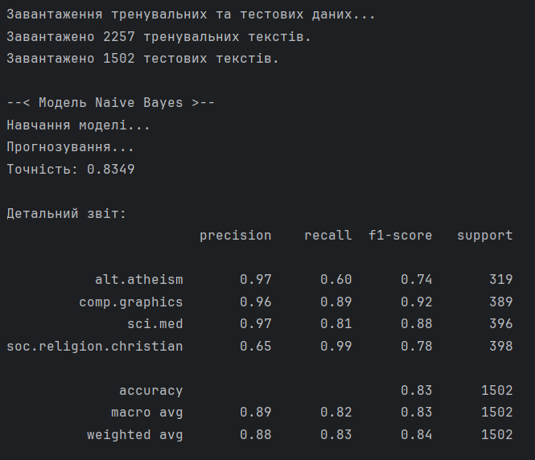
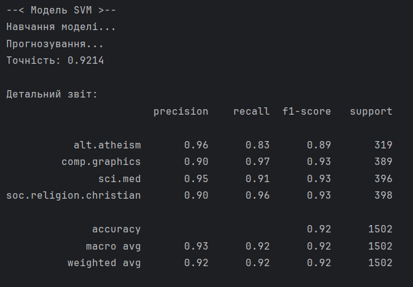

# ЗАВДАННЯ (7 ВАРІАНТ)

## Умова:

Класифікація текстів за допомогою машинного навчання: Реалізувати класифікацію текстових документів за допомогою Naive Bayes або Support Vector Machine (SVM).

*У цьому завданні реалізовано та порівняно роботу обох алгоритмів для наочності.

## [Код до завдання](task_files/main.py)

## Як працює програма:

Програма використовує відомий набір текстових даних 20 Newsgroups (новинні групи), вбудований у бібліотеку scikit-learn. Для оптимізації швидкості роботи та наочності результатів було обрано 4 тематичні категорії: alt.atheism, soc.religion.christian, comp.graphics та sci.med.
Перш ніж тексти потрапляють у моделі машинного навчання, вони проходять етап векторизації.

### 1. Сплайнова інтерполяція

Метод використовує математичні функції (поліноми 3-го ступеня, або "кубічні сплайни"), щоб провести через відомі точки навколо пропуску максимально гладку криву.
Плюсом є дуже висока точність та швидкість обчислень для поодиноких пропусків. Графік виглядає природно. Мінусом є те, що цей метод не розуміє контексту чи сезонності. Якщо відсутній шматок даних за цілий день, сплайн просто проведе лінію, ігноруючи ймовірні денні піки споживання.

### 2. Поліноміальна інтерполяція

Метод намагається підібрати загальне математичне рівняння (у нашому випадку — параболу 2-го ступеня), яке пройде через відомі точки. Мінусом цього методу є те, що при великих пропусках або складних коливаннях поліном може малювати неадекватні піки або провали. У тестах цей метод показав найбільшу похибку (RMSE).


### 3. Шумоподавлюючий автоенкодер

Це нейронна мережа на базі TensorFlow/Keras, яка складається з `енкодера` (стискає дані, виділяючи головні патерни) та `декодера` (розпаковує їх назад). Замість повнозв'язних шарів використано одномірні згортки `Conv1D`, які ковзають по графіку та вловлюють локальні тренди (ранкові/вечірні стрибки споживання). 
Мережа навчається на ідеальних 24-годинних відрізках, які навмисне псуються значенням поза діапазоном нормалізації (маркером -1):

```
random_mask = np.random.rand(*X_data.shape) < 0.15
X_data[random_mask] = -1.0
```

Мережа змушена дивитися на зіпсований графік і відновлювати еталонний.
Плюс автоенкодера в тому, що нейромережа враховує контекст та добову сезонність. Якщо відсутні дані за пів дня, автоенкодер візьме типовий патерн і згенерує правдоподібний денний пік, де математичні методи просто намалювали б пряму. З іншої сторони мінус такого методу в тому, що нейронка потребує великої кількості даних для навчання та може згладжувати нетипові аномалії.

### Оцінка продуктивності

За результатами роботи різних алгоритмів було виявлено, що для швидкого заповнення випадкових поодиноких втрачених точок (1-2 години) найкраще підходять сплайни, бо цей метод працює швидко і точно. Але при довгих блокових пропусках автоенкодер здатний домалювати втрачені дані, спираючись на історичні патерни споживачів, чого не можуть зробити математичні формули.

## Результат роботи:



P.S. Warning - це приколи Tenserflow, він ні на що не впливає.




