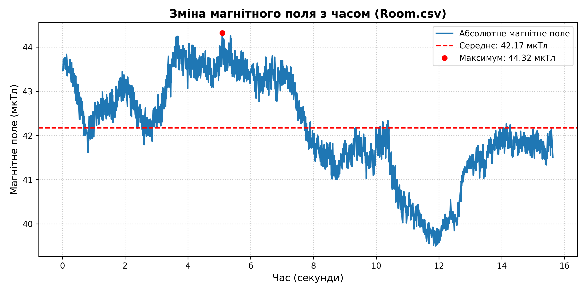
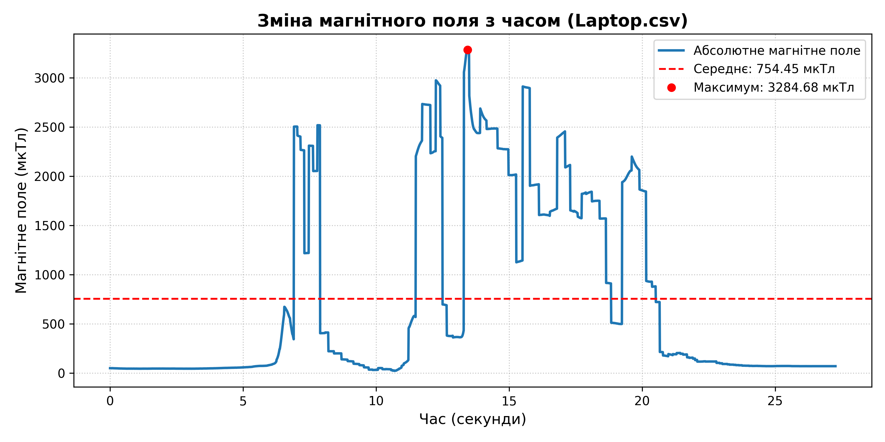
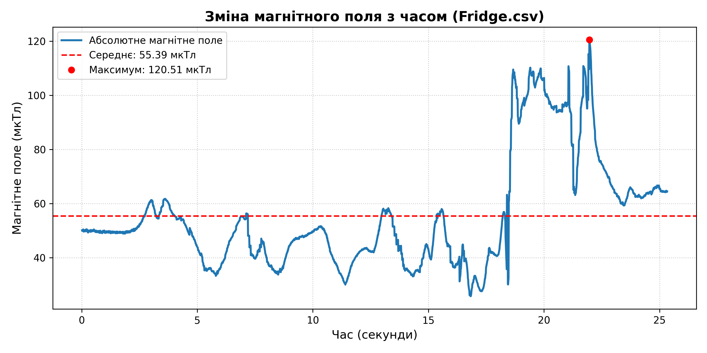
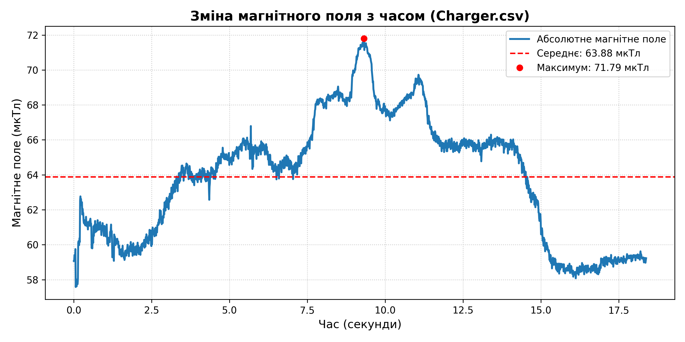
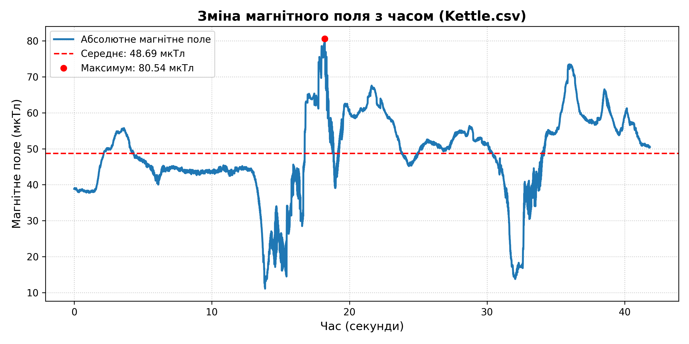
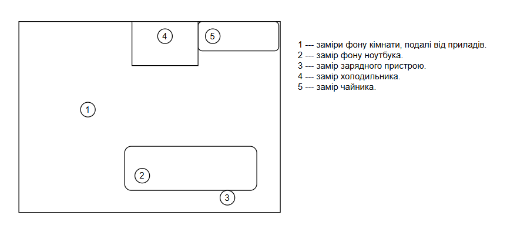

# ЗАВДАННЯ (7 ВАРІАНТ)

## Умова:

Визначення рівня магнітного поля в різних зонах кімнати. Завдання передбачає вимірювання рівня магнітного поля поблизу електричних пристроїв, таких як ноутбук, зарядний пристрій, холодильник та електрочайник, а також визначення джерел можливих аномалій. Обробка даних включає виявлення джерел аномалій і побудову карти магнітного поля в приміщенні.

## [Код до завдання](task_files/main.py)

## Обладнання та програмне забезпечення:

Заміри проводились за допомогою мобільного додатку Phyphox (для збору даних та експорту в CSV), на пристрої Apple iPhone 15 Pro Max (вбудований датчик магнітометра).

### Теоретичні відомості 

Нормальний фоновий рівень магнітного поля Землі становить приблизно від 30 до 60 мікротесла (мкТл). Будь-які значення, що значно перевищують цей показник у побутових умовах, свідчать про наявність штучних джерел електромагнітного випромінювання. Вони можуть створюватися постійними магнітами всередині приладів або виникати як наслідок протікання електричного струму.

### Методика проведення експерименту

Для початку було записано стандартний магнітний фон кімнати на віддалені від пристроїв.

Запис у додатку Phyphox вмикався на відстані 1-2 метри від приладу. Смартфон утримувався нерухомо протягом кількох секунд для фіксації стабільного фонового магнітного поля кімнати. Потім смартфон повільно підносився впритул до досліджуваного приладу. А далі обертався та переміщувався вздовж усіх площин приладу, щоб зафіксувати максимальні значення та визначити точне розташування джерела магнітного поля всередині корпусу.

### Результати експеременту

Під час обробки масивів даних та побудови графіків було виявлено характерну поведінку магнітного поля, яка підтверджує правильність обраної методики вимірювання. На кожному графіку чітко простежуються три послідовні фази. Спочатку фіксується відносно рівна пряма лінія, яка відображає стабільне фонове магнітне поле Землі та самої кімнати, що становить приблизно 45 мкТл. Наступним етапом є різкий стрибок значень, який відбувається безпосередньо в момент наближення смартфона до досліджуваного електричного приладу. Після цього на графіку з'являються виражені коливання у вигляді піків та западин, що є результатом обертання та переміщення датчика навколо корпусу пристрою під час пошуку джерела випромінювання.
Аналіз цих коливань дозволив виявити кілька важливих фізичних закономірностей. Насамперед, була підтверджена сильна залежність магнітної індукції від відстані до джерела. Магнітне поле стрімко спадає в міру віддалення від приладу. На відстані понад тридцять-п'ятдесят сантиметрів від будь-якого досліджуваного об'єкта рівень магнітного поля практично повністю повертається до природного фонового значення кімнати, а значні аномалії фіксуються виключно при наближенні датчика майже впритул до корпусу.
Крім того, вимірювання довели, що побутові прилади не випромінюють магнітне поле рівномірно всією своєю поверхнею. Завдяки обертанню смартфона стало зрозуміло, що випромінювання має чітку локалізацію, а джерелами найсильніших магнітних аномалій є конкретні внутрішні вузли пристроїв. Наприклад, під час дослідження ноутбука найвищі показники магнітного поля фіксувалися біля гнізда підключення зарядного пристрою, де відбувається трансформація та розподіл струму. У випадку з холодильником найсильніше поле було зафіксовано у його верхній частині, де, найімовірніше, розташовані основні елементи системи охолодження.

Цікавим додатковим спостереженням під час виконання роботи стала спроба зафіксувати магнітні аномалії поблизу комп'ютера за допомогою стандартного вбудованого додатка "Компас" на iOS. На відміну від Phyphox, стандартний компас не показав жодних суттєвих відхилень. Це пояснюється тим, що операційна система смартфона застосовує алгоритми програмної фільтрації (компенсації) для стабілізації стрілки компаса, автоматично відсікаючи локальні побутові магнітні аномалії як шум, щоб компас продовжував коректно вказувати на Північ. Крім того, компас виводить сильно згладжені дані у вигляді напрямку (градусів), а не абсолютної сили поля, а також окрім алгоритмів, iPhone використовує дані з датчиків GPS, гіроскопа та акселерометра для визначення напрямку та положення телефона (спроба їх відключення через увімкнення режиму польоту не допомогла, оскільки після одного з оновлень безпеки IOS телефон продовжує збирати інформацію з датчиків GPS навіть в режимі польоту чи у вимкненому стані, щоб телефон можна було знайти у разі втрати, а на акселерометр та гіроскоп це не впливає взагалі). Додаток Phyphox, натомість, знімає незгладжені сирі дані безпосередньо з магнітометра в обхід системних фільтрів, що і дозволило успішно зафіксувати та проаналізувати всі локальні зміни електромагнітної обстановки.

### Карта магнітного поля приміщення

